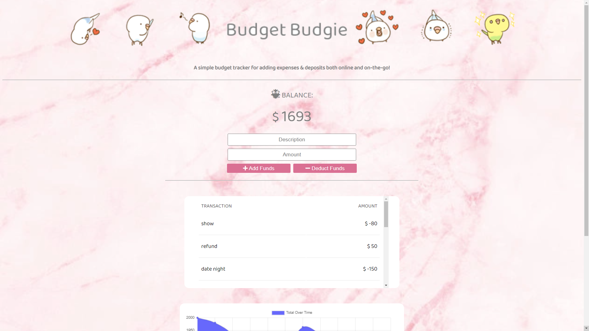
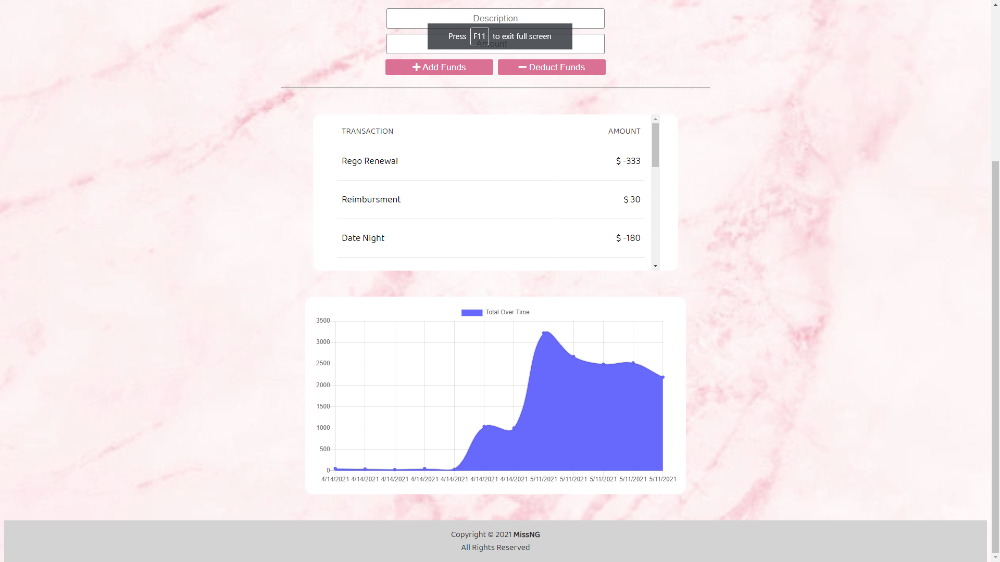

# Unit 18 PWA: Online/Offline Budget Trackers

## ⋘ ──── ∗⋅◦∘◈\[[Budget Budgie](https://budget-budgie.herokuapp.com/)\]◈∘◦⋅∗ ──── ⋙

**Budget Budgie** was created to allows users to track both their expenses and deposits, whether they were online or offline. When online, a transaction will be added to the data table and chart in real-time. When entering a transaction offline, the totals will populate the table data andd update the total as soon as a user returns online.

The app is conveniently deployed to [Heroku Platform](https://www.heroku.com/) with [MongoDB Atlas](https://www.mongodb.com/cloud/atlas), and features dynamic HTML, styling with CSS and data handling via MongoDB & Mongoose.

List of Technologies Utilized include...

- HTML, CSS, Javascript
- [Bootstrap CSS](https://getbootstrap.com/)
- [GoogleFonts](https://fonts.google.com/)
- [FontAwesome](https://fontawesome.com/)
- [GitBash](https://gitforwindows.org/)
- [Node Environment](https://nodejs.org/en/about/)
- [Express.js Framework](https://expressjs.com/)
- [MongoDB Atlas](https://www.mongodb.com/cloud/atlas)
- [Mongoose Schema](https://mongoosejs.com/)
- [Morgan package](https://www.npmjs.com/package/morgan)
- [Heroku Platform](https://www.heroku.com/)
- [MongoDB Atlas](https://www.mongodb.com/cloud/atlas)

## ≫ ──── ≪•◦ OBJECTIVES ◦•≫ ──── ≪

```
+ AS AN avid traveller
+ I WANT to be able to track my withdrawals and deposits with or without a data/internet connection
+ SO THAT my account balance is accurate when I am traveling
```

## ≫ ──── ≪•◦ MOCK-UP ◦•≫ ──── ≪

The following images show the web application's appearance & functionality:

<p float="left">
    
    
</p>

### ≫ ──── ≪•◦ CODE FUNCTIONALITY ◦•≫ ──── ≪

- Application allows user to add transactions on/offline.

- Application stores data entered when offline then updates tables & budget once back online.

- Application is successfully deployed to Heroku via MongoDB Atlas and can be visited [here](https://budget-budgie.herokuapp.com/)!

### ≫ ──── ≪•◦ USABILITY ◦•≫ ──── ≪

1. Navigate to deployed application page on [Heroku](https://budget-budgie.herokuapp.com/)
2. The current balance will be displayed under "Balance"
3. Enter the transaction description in the **Description** text box
4. Enter the transaction amount in the **Amount** number box
5. If the transaction is a deposit, click **+ Add Funds** to see balance increase
6. If the transaction is an expense, click **- Deduct Funds** to see balance decrease
   _Note the transaction details will also update the "Transaction" & "Total Over Time" tables_
7. Transactions may also be entered into the app when user is offline, and will update the balance & tables as soon as an internet connection is established.
